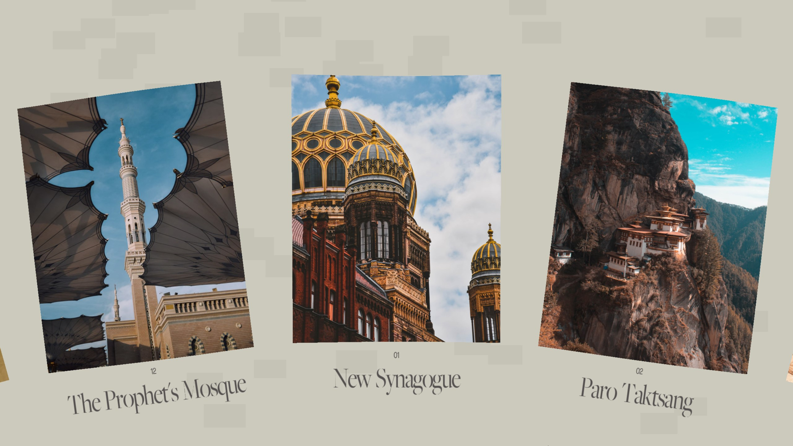

# Infinite Circular WebGL Gallery

A tutorial explaining how to build an infinite circular gallery using WebGL with OGL and GLSL Shaders.



[Article on Codrops](https://tympanus.net/codrops/?p=53491)

[Demo](https://codrops.com/Tutorials/InfiniteCircularGallery/)

## Installation

Install dependencies:

```
npm install
```

Compile the code for development and start a local server:

```
npm start
```

Create the build:

```
npm run build
```

## Credits

- https://unsplash.com/@zane404

## Misc

Follow Luis Henrique Bizarro: [Website](https://bizar.ro/), [Twitter](https://twitter.com/lhbizarro), [GitHub](https://github.com/lhbizarro)

Follow Codrops: [Twitter](http://www.twitter.com/codrops), [Facebook](http://www.facebook.com/codrops), [GitHub](https://github.com/codrops), [Instagram](https://www.instagram.com/codropsss/)

## License
[MIT](LICENSE)

Made with :blue_heart: by [Codrops](http://www.codrops.com)
